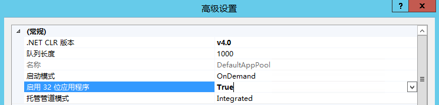

# ASP版Redis试验整理

## 参考资料:

* [ASP使用Redis](https://www.jiezhe.net/post/51.html)
* [windows下安装Redis并部署成服务](https://blog.csdn.net/liangxw1/article/details/82864581)

## 注意事项

* 启动32位应用程序

* 运行的机器必须支持.net framework 4.0

* Redis.Connect的参数符合Redis服务器的实际情况
